# Micro-Frontend Golden Sample Architecture

[](https://reactjs.org/)
[](https://www.typescriptlang.org/)
[](https://mui.com/)
[](https://fastapi.tiangolo.com/)
[](https://www.docker.com/)
[](https://webpack.js.org/concepts/module-federation/)

> A production-ready micro-frontend architecture demonstrating Webpack Module Federation, React, Material-UI, FastAPI backend, JWT authentication, and complete Docker orchestration.

---

## 📋 Table of Contents

1. [Overview](#overview)
2. [Overall Architecture](#1-overall-architecture)
3. [Module Federation Integration](#2-module-federation-integration)
4. [Authentication & Data Sharing](#3-authentication--data-sharing)
5. [Dockerization](#4-dockerization)
6. [GitHub Registry Deployment](#5-github-registry-deployment)
7. [Quick Start](#quick-start)
8. [Technology Stack](#technology-stack)
9. [Project Structure](#project-structure)
10. [Contributing](#contributing)

---

## Overview

This project showcases a **golden sample** implementation of micro-frontend architecture using **Webpack Module Federation**. It demonstrates how to build, deploy, and manage independent micro-applications that work together seamlessly while maintaining autonomous development and deployment.

### Key Features

✅ **Micro-Frontend Architecture** - Independent, deployable frontend applications  
✅ **Module Federation** - Runtime code sharing without build-time coupling  
✅ **Material-UI Design System** - Consistent theming across all micro-apps  
✅ **JWT Authentication** - Secure token-based authentication with refresh tokens  
✅ **FastAPI Backend** - High-performance Python backend with async support  
✅ **Docker Orchestration** - Complete containerization with docker-compose  
✅ **Shared UI Library** - Reusable components, themes, and utilities  
✅ **TypeScript** - Type-safe development across all applications  
✅ **Error Boundaries** - Graceful error handling for remote module failures  

---

## 1. Overall Architecture

### System Context Diagram

```mermaid
C4Context
    title System Context - Micro-Frontend Platform

    Person(user, "User", "End user accessing the platform")
    
    System_Boundary(platform, "Micro-Frontend Platform") {
        System(container, "Container App", "Host application orchestrating micro-frontends")
        System(userApp, "User Management", "Micro-frontend for user management")
        System(dataApp, "Data Grid", "Micro-frontend for data visualization")
        System(analyticsApp, "Analytics", "Micro-frontend for analytics")
        System(settingsApp, "Settings", "Micro-frontend for settings")
        System(backend, "Backend API", "FastAPI service with JWT auth")
    }
    
    System_Ext(github, "GitHub Registry", "Container image registry")
    
    Rel(user, container, "Uses", "HTTPS")
    Rel(container, userApp, "Loads", "Module Federation")
    Rel(container, dataApp, "Loads", "Module Federation")
    Rel(container, analyticsApp, "Loads", "Module Federation")
    Rel(container, settingsApp, "Loads", "Module Federation")
    
    Rel(userApp, backend, "API Calls", "REST/JSON")
    Rel(dataApp, backend, "API Calls", "REST/JSON")
    Rel(analyticsApp, backend, "API Calls", "REST/JSON")
    Rel(settingsApp, backend, "API Calls", "REST/JSON")
    
    Rel(platform, github, "Pulls images", "Docker")
```

### High-Level Architecture

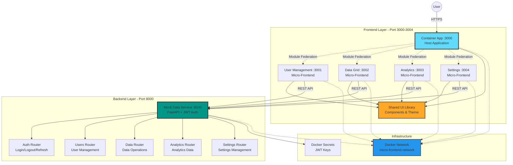

### Component Diagram

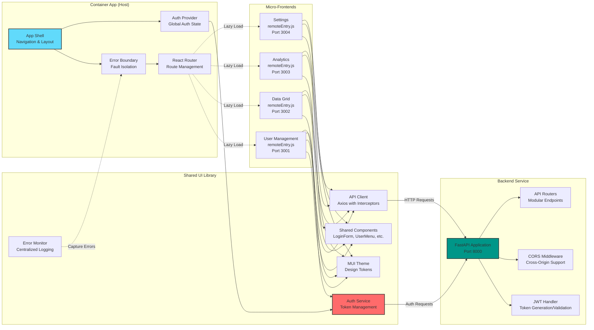

---

## 2. Module Federation Integration

### How Module Federation Works

**Module Federation** allows multiple independent builds to form a single application. Each build acts as a container and can consume code from other containers, enabling true micro-frontend architecture.

### Module Federation Configuration

```mermaid
graph TB
    subgraph "Container App - Host (Port 3000)"
        HostConfig[ModuleFederationPlugin<br/>name: 'container']
        HostRemotes[Remotes Configuration]
        HostShared[Shared Dependencies<br/>React, MUI, etc.]
        
        HostConfig --> HostRemotes
        HostConfig --> HostShared
        
        HostRemotes -->|userApp| UserRemote[userApp@http://localhost:3001/remoteEntry.js]
        HostRemotes -->|dataApp| DataRemote[dataApp@http://localhost:3002/remoteEntry.js]
        HostRemotes -->|analyticsApp| AnalyticsRemote[analyticsApp@http://localhost:3003/remoteEntry.js]
        HostRemotes -->|settingsApp| SettingsRemote[settingsApp@http://localhost:3004/remoteEntry.js]
    end
    
    subgraph "User Management App - Remote (Port 3001)"
        UserConfig[ModuleFederationPlugin<br/>name: 'userApp']
        UserExposes[Exposes<br/>./UserManagement: ./src/App.tsx]
        UserShared[Shared Dependencies<br/>singleton: true]
        
        UserConfig --> UserExposes
        UserConfig --> UserShared
    end
    
    subgraph "Data Grid App - Remote (Port 3002)"
        DataConfig[ModuleFederationPlugin<br/>name: 'dataApp']
        DataExposes[Exposes<br/>./DataGrid: ./src/App.tsx]
        DataShared[Shared Dependencies<br/>singleton: true]
        
        DataConfig --> DataExposes
        DataConfig --> DataShared
    end
    
    subgraph "Analytics App - Remote (Port 3003)"
        AnalyticsConfig[ModuleFederationPlugin<br/>name: 'analyticsApp']
        AnalyticsExposes[Exposes<br/>./Analytics: ./src/App.tsx]
        AnalyticsShared[Shared Dependencies<br/>singleton: true]
        
        AnalyticsConfig --> AnalyticsExposes
        AnalyticsConfig --> AnalyticsShared
    end
    
    subgraph "Settings App - Remote (Port 3004)"
        SettingsConfig[ModuleFederationPlugin<br/>name: 'settingsApp']
        SettingsExposes[Exposes<br/>./Settings: ./src/App.tsx]
        SettingsShared[Shared Dependencies<br/>singleton: true]
        
        SettingsConfig --> SettingsExposes
        SettingsConfig --> SettingsShared
    end
    
    UserRemote -.-> UserExposes
    DataRemote -.-> DataExposes
    AnalyticsRemote -.-> AnalyticsExposes
    SettingsRemote -.-> SettingsExposes
    
    style HostConfig fill:#61dafb,stroke:#333,stroke-width:3px
    style UserConfig fill:#4ecdc4,stroke:#333,stroke-width:2px
    style DataConfig fill:#ff6b6b,stroke:#333,stroke-width:2px
    style AnalyticsConfig fill:#95e1d3,stroke:#333,stroke-width:2px
    style SettingsConfig fill:#ffa726,stroke:#333,stroke-width:2px
```

### Runtime Module Loading Sequence

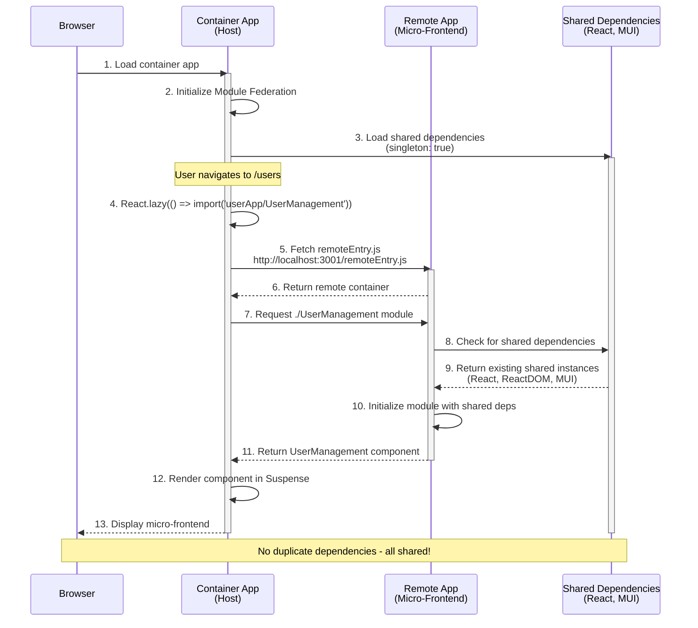

### Key Module Federation Concepts

#### 1. **Singleton Sharing**
Ensures only one instance of shared dependencies (React, MUI) is loaded:

```javascript
// Container webpack.config.js
shared: {
  react: {
    singleton: true,      // Only one instance across all micro-frontends
    requiredVersion: "18.2.0",
    strictVersion: false,
    eager: true,         // Load immediately (not lazy)
  },
  '@mui/material': {
    singleton: true,      // Shared MUI instance
    requiredVersion: '^5.15.0',
  }
}
```

#### 2. **Exposing Modules**
Each micro-frontend exposes its entry component:

```javascript
// user-management-app webpack.config.js
exposes: {
  './UserManagement': './src/App.tsx',  // Expose the main component
}
```

#### 3. **Consuming Remote Modules**
The container app dynamically loads remote modules:

```javascript
remotes: {
  userApp: 'userApp@http://localhost:3001/remoteEntry.js',
  dataApp: 'dataApp@http://localhost:3002/remoteEntry.js',
  // ... other remotes
}
```

#### 4. **Lazy Loading with Error Boundaries**
Safe loading of remote modules with fallback:

```typescript
// Container App.tsx
const UserManagement = React.lazy(() => import('userApp/UserManagement'));

<ErrorBoundary componentName="User Management App">
  <Suspense fallback={<LoadingSpinner />}>
    <UserManagement />
  </Suspense>
</ErrorBoundary>
```

---

## 3. Authentication & Data Sharing

### JWT Authentication Flow

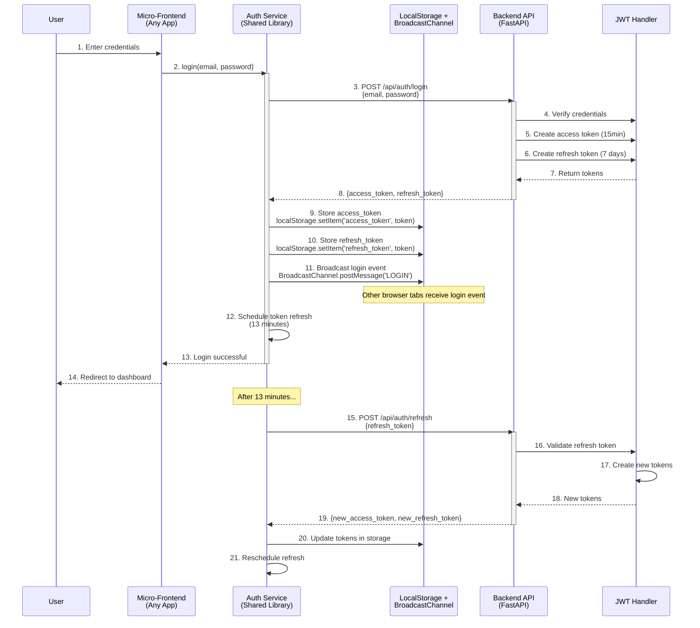

### Logout Flow

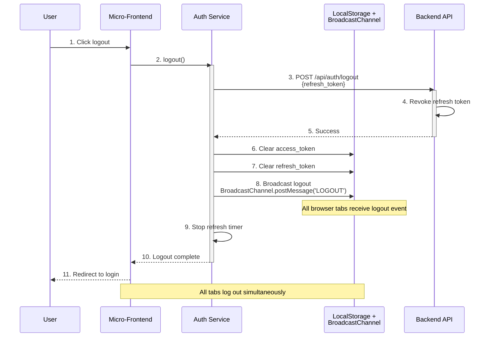

### Cross-Tab Synchronization

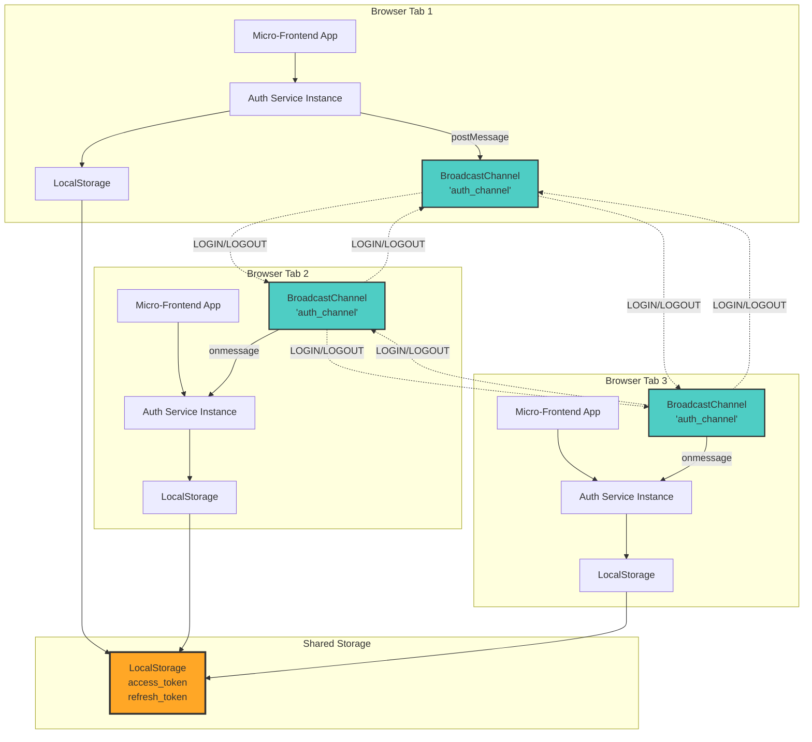

### Data Sharing Architecture

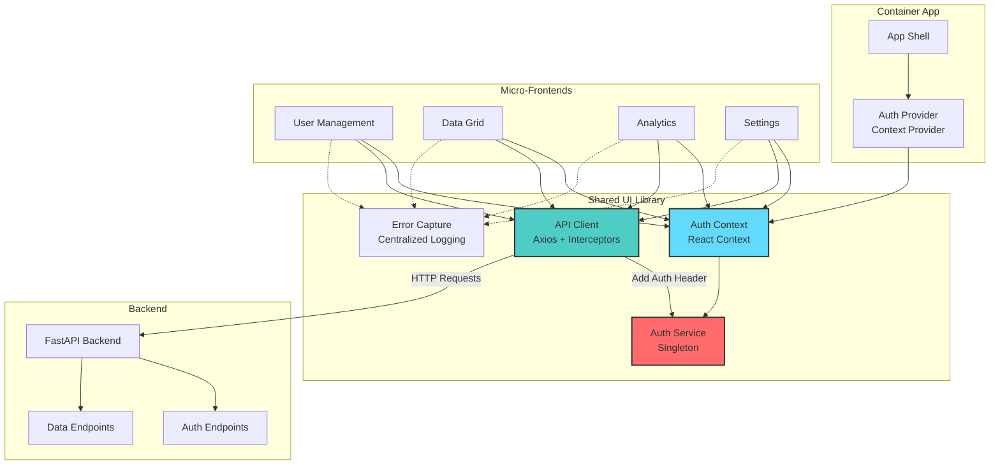

### API Client with Interceptors

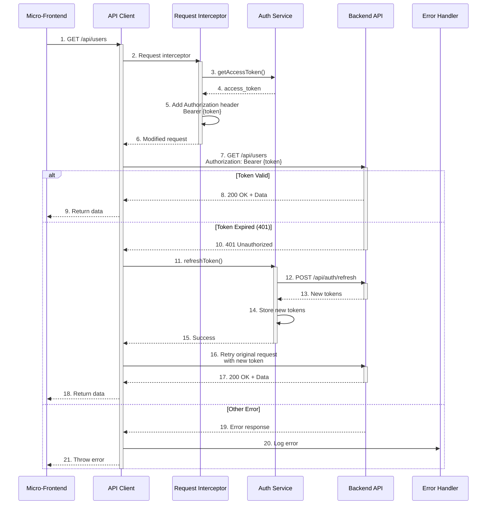

### Authentication Implementation Details

#### Auth Service (Singleton Pattern)

```typescript
// Shared UI Library - AuthService.ts
class AuthService {
  private static instance: AuthService;
  private refreshTimer: NodeJS.Timeout | null = null;
  private broadcastChannel: BroadcastChannel | null = null;

  // Singleton instance
  static getInstance(): AuthService {
    if (!AuthService.instance) {
      AuthService.instance = new AuthService();
    }
    return AuthService.instance;
  }

  // Login with automatic token refresh scheduling
  async login(credentials: LoginCredentials): Promise<TokenResponse> {
    const response = await apiClient.post('/auth/login', credentials);
    this.storeTokens(response.data);
    this.scheduleTokenRefresh(); // Refresh in 13 minutes
    this.broadcastMessage({ type: 'LOGIN', tokens: response.data });
    return response.data;
  }

  // Schedule token refresh before expiry
  private scheduleTokenRefresh(): void {
    const refreshInterval = 13 * 60 * 1000; // 13 minutes
    this.refreshTimer = setTimeout(async () => {
      await this.refreshToken();
    }, refreshInterval);
  }
}
```

#### API Client with Interceptors

```typescript
// Shared UI Library - apiClient.ts
import axios from 'axios';
import authService from './auth/AuthService';

const apiClient = axios.create({
  baseURL: process.env.REACT_APP_API_URL || 'http://localhost:8000',
  headers: { 'Content-Type': 'application/json' }
});

// Request interceptor - Add auth token
apiClient.interceptors.request.use(
  (config) => {
    const token = authService.getAccessToken();
    if (token) {
      config.headers.Authorization = `Bearer ${token}`;
    }
    return config;
  },
  (error) => Promise.reject(error)
);

// Response interceptor - Handle token refresh
apiClient.interceptors.response.use(
  (response) => response,
  async (error) => {
    const originalRequest = error.config;
    
    // If 401 and not already retried, refresh token
    if (error.response?.status === 401 && !originalRequest._retry) {
      originalRequest._retry = true;
      
      try {
        await authService.refreshToken();
        const token = authService.getAccessToken();
        originalRequest.headers.Authorization = `Bearer ${token}`;
        return apiClient(originalRequest); // Retry with new token
      } catch (refreshError) {
        // Refresh failed, logout user
        window.dispatchEvent(new CustomEvent('auth:logout'));
        return Promise.reject(refreshError);
      }
    }
    
    return Promise.reject(error);
  }
);
```

#### Backend JWT Implementation

```python
# Backend - jwt_handler.py
from datetime import datetime, timedelta
from jose import JWTError, jwt
from config.settings import settings

def create_access_token(data: dict) -> str:
    """Create JWT access token (15 minutes expiry)"""
    to_encode = data.copy()
    expire = datetime.utcnow() + timedelta(minutes=settings.ACCESS_TOKEN_EXPIRE_MINUTES)
    to_encode.update({"exp": expire, "type": "access"})
    
    encoded_jwt = jwt.encode(
        to_encode, 
        settings.JWT_SECRET_KEY, 
        algorithm=settings.JWT_ALGORITHM
    )
    return encoded_jwt

def create_refresh_token(data: dict) -> str:
    """Create JWT refresh token (7 days expiry)"""
    to_encode = data.copy()
    expire = datetime.utcnow() + timedelta(days=settings.REFRESH_TOKEN_EXPIRE_DAYS)
    to_encode.update({"exp": expire, "type": "refresh"})
    
    encoded_jwt = jwt.encode(
        to_encode, 
        settings.JWT_REFRESH_SECRET_KEY, 
        algorithm=settings.JWT_ALGORITHM
    )
    return encoded_jwt
```

---

## 4. Dockerization

### Docker Architecture

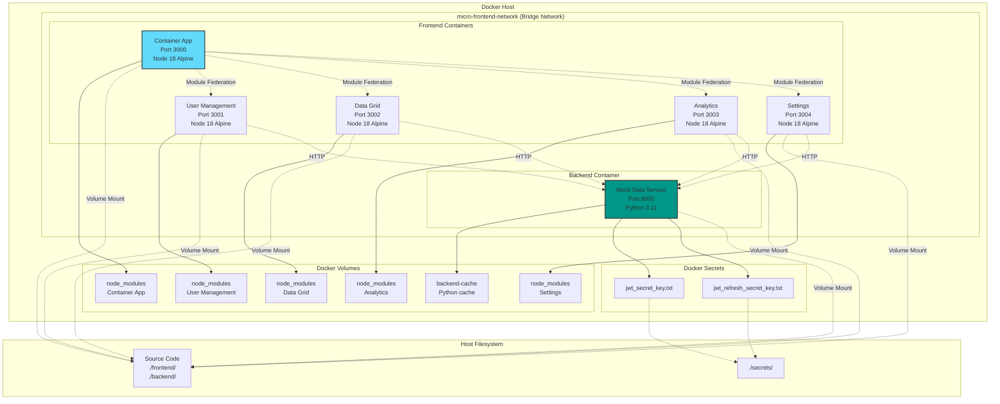

### Multi-Stage Build Process

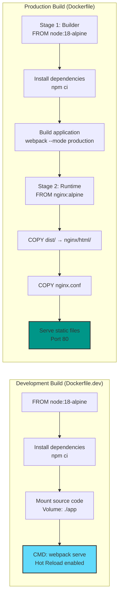

### Container Orchestration Flow

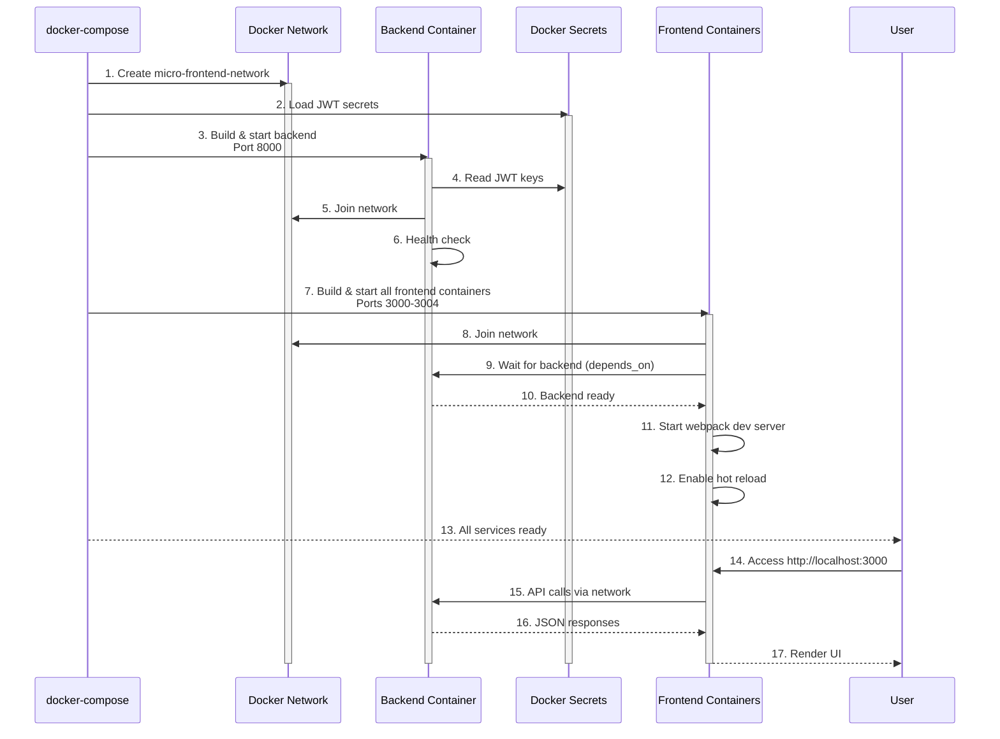

### Docker Compose Services

```yaml
# docker-compose.yml
version: '3.8'

services:
  # Backend Service
  backend:
    build:
      context: ./backend/mock-data-service
      dockerfile: Dockerfile
    container_name: micro-frontend-backend
    ports:
      - "8000:8000"
    environment:
      - JWT_SECRET_KEY_FILE=/run/secrets/jwt_secret_key
      - JWT_REFRESH_SECRET_KEY_FILE=/run/secrets/jwt_refresh_secret_key
    networks:
      - micro-frontend-network
    secrets:
      - jwt_secret_key
      - jwt_refresh_secret_key
    healthcheck:
      test: ["CMD", "curl", "-f", "http://localhost:8000/health"]
      interval: 30s
      timeout: 10s
      retries: 3

  # Container App (Host)
  container-app:
    build:
      context: ./frontend/container
      dockerfile: Dockerfile.dev
    ports:
      - "3000:3000"
    volumes:
      - ./frontend/container:/app
      - /app/node_modules
    depends_on:
      - user-management-app
      - data-grid-app
      - analytics-app
      - settings-app
    networks:
      - micro-frontend-network

networks:
  micro-frontend-network:
    driver: bridge

secrets:
  jwt_secret_key:
    file: ./secrets/jwt_secret_key.txt
  jwt_refresh_secret_key:
    file: ./secrets/jwt_refresh_secret_key.txt
```

### Dockerfile Examples

#### Frontend Production Dockerfile

```dockerfile
# Multi-stage build for Container App
FROM node:18-alpine AS builder

WORKDIR /app

# Install dependencies
COPY package*.json ./
RUN npm ci --legacy-peer-deps

# Copy source and build
COPY . .
RUN npx webpack --config webpack.config.js --mode production

# Production stage with nginx
FROM nginx:alpine

# Copy built assets
COPY --from=builder /app/dist /usr/share/nginx/html

# Copy nginx configuration
COPY nginx.conf /etc/nginx/conf.d/default.conf

EXPOSE 80

CMD ["nginx", "-g", "daemon off;"]
```

#### Backend Dockerfile

```dockerfile
FROM python:3.11-slim

WORKDIR /app

# Install dependencies
COPY requirements.txt .
RUN pip install --no-cache-dir -r requirements.txt

# Copy application code
COPY . .

EXPOSE 8000

# Health check
HEALTHCHECK --interval=30s --timeout=3s --start-period=5s --retries=3 \
  CMD python -c "import requests; requests.get('http://localhost:8000/health')" || exit 1

CMD ["uvicorn", "main:app", "--host", "0.0.0.0", "--port", "8000"]
```

### Docker Network Communication

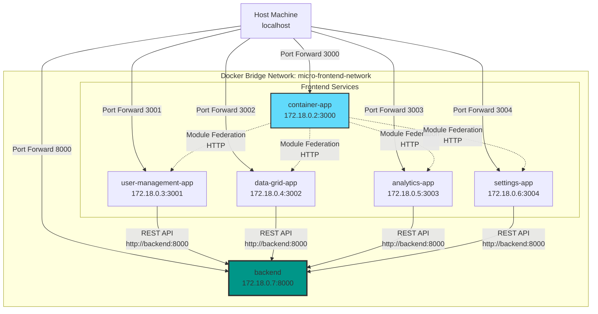

---

## 5. GitHub Registry Deployment

### CI/CD Pipeline

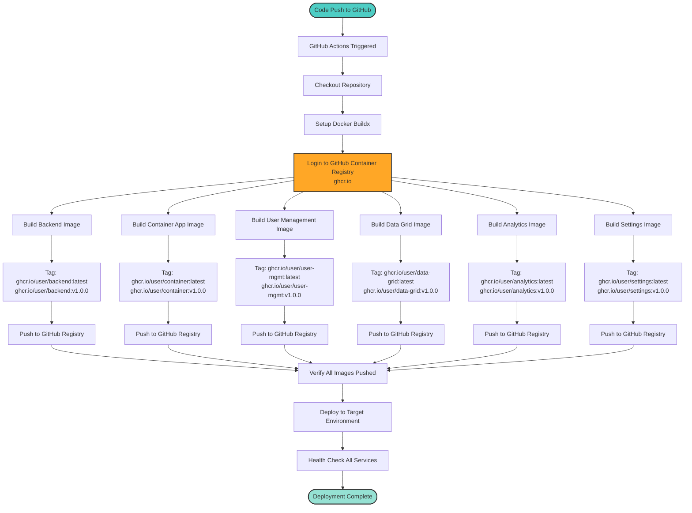

### GitHub Actions Workflow

```yaml
# .github/workflows/docker-publish.yml
name: Build and Push Docker Images

on:
  push:
    branches: [ main, develop ]
    tags: [ 'v*' ]
  pull_request:
    branches: [ main ]

env:
  REGISTRY: ghcr.io
  IMAGE_PREFIX: ${{ github.repository_owner }}

jobs:
  build-and-push:
    runs-on: ubuntu-latest
    permissions:
      contents: read
      packages: write

    strategy:
      matrix:
        service:
          - name: backend
            context: ./backend/mock-data-service
            dockerfile: Dockerfile
          - name: container-app
            context: ./frontend/container
            dockerfile: Dockerfile
          - name: user-management
            context: ./frontend/user-management-app
            dockerfile: Dockerfile
          - name: data-grid
            context: ./frontend/data-grid-app
            dockerfile: Dockerfile
          - name: analytics
            context: ./frontend/analytics-app
            dockerfile: Dockerfile
          - name: settings
            context: ./frontend/settings-app
            dockerfile: Dockerfile

    steps:
      - name: Checkout repository
        uses: actions/checkout@v3

      - name: Set up Docker Buildx
        uses: docker/setup-buildx-action@v2

      - name: Log in to GitHub Container Registry
        uses: docker/login-action@v2
        with:
          registry: ${{ env.REGISTRY }}
          username: ${{ github.actor }}
          password: ${{ secrets.GITHUB_TOKEN }}

      - name: Extract metadata
        id: meta
        uses: docker/metadata-action@v4
        with:
          images: ${{ env.REGISTRY }}/${{ env.IMAGE_PREFIX }}/${{ matrix.service.name }}
          tags: |
            type=ref,event=branch
            type=ref,event=pr
            type=semver,pattern={{version}}
            type=semver,pattern={{major}}.{{minor}}
            type=sha

      - name: Build and push Docker image
        uses: docker/build-push-action@v4
        with:
          context: ${{ matrix.service.context }}
          file: ${{ matrix.service.context }}/${{ matrix.service.dockerfile }}
          push: true
          tags: ${{ steps.meta.outputs.tags }}
          labels: ${{ steps.meta.outputs.labels }}
          cache-from: type=gha
          cache-to: type=gha,mode=max
```

### Image Tagging Strategy

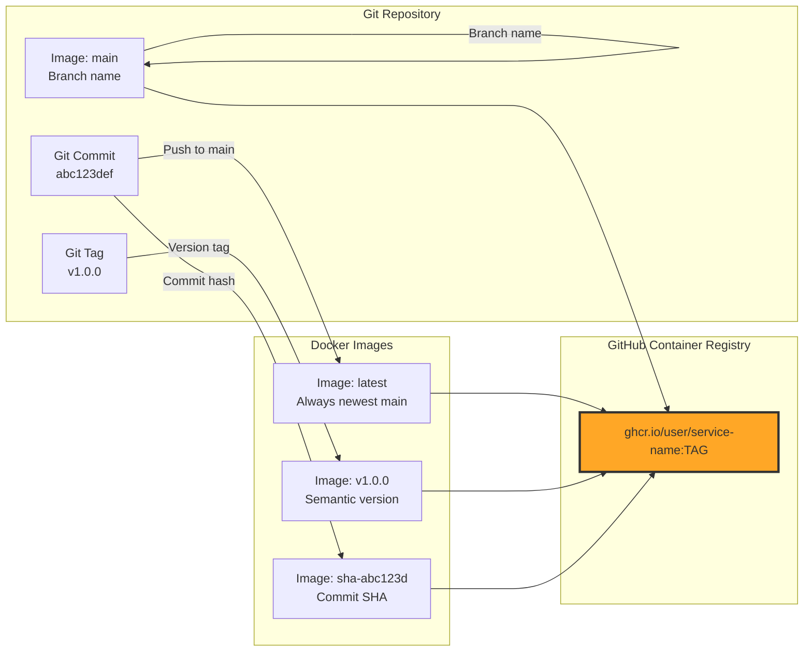

### Deployment Commands

#### 1. Build All Images Locally

```bash
# Build development images
make build

# Build production images
make prod-build

# Build specific service
docker-compose build container-app
```

#### 2. Tag Images for GitHub Registry

```bash
# Set your GitHub username
GITHUB_USER="your-username"

# Tag backend
docker tag micro-frontend-backend ghcr.io/$GITHUB_USER/backend:latest
docker tag micro-frontend-backend ghcr.io/$GITHUB_USER/backend:v1.0.0

# Tag container app
docker tag micro-frontend-container ghcr.io/$GITHUB_USER/container-app:latest
docker tag micro-frontend-container ghcr.io/$GITHUB_USER/container-app:v1.0.0

# Tag user management
docker tag micro-frontend-user-management ghcr.io/$GITHUB_USER/user-management:latest
docker tag micro-frontend-user-management ghcr.io/$GITHUB_USER/user-management:v1.0.0

# Tag data grid
docker tag micro-frontend-data-grid ghcr.io/$GITHUB_USER/data-grid:latest
docker tag micro-frontend-data-grid ghcr.io/$GITHUB_USER/data-grid:v1.0.0

# Tag analytics
docker tag micro-frontend-analytics ghcr.io/$GITHUB_USER/analytics:latest
docker tag micro-frontend-analytics ghcr.io/$GITHUB_USER/analytics:v1.0.0

# Tag settings
docker tag micro-frontend-settings ghcr.io/$GITHUB_USER/settings:latest
docker tag micro-frontend-settings ghcr.io/$GITHUB_USER/settings:v1.0.0
```

#### 3. Login to GitHub Container Registry

```bash
# Create a Personal Access Token (PAT) with write:packages scope
# Then login
echo $GITHUB_TOKEN | docker login ghcr.io -u $GITHUB_USER --password-stdin
```

#### 4. Push Images to Registry

```bash
# Push all tagged images
docker push ghcr.io/$GITHUB_USER/backend:latest
docker push ghcr.io/$GITHUB_USER/backend:v1.0.0

docker push ghcr.io/$GITHUB_USER/container-app:latest
docker push ghcr.io/$GITHUB_USER/container-app:v1.0.0

docker push ghcr.io/$GITHUB_USER/user-management:latest
docker push ghcr.io/$GITHUB_USER/user-management:v1.0.0

docker push ghcr.io/$GITHUB_USER/data-grid:latest
docker push ghcr.io/$GITHUB_USER/data-grid:v1.0.0

docker push ghcr.io/$GITHUB_USER/analytics:latest
docker push ghcr.io/$GITHUB_USER/analytics:v1.0.0

docker push ghcr.io/$GITHUB_USER/settings:latest
docker push ghcr.io/$GITHUB_USER/settings:v1.0.0
```

#### 5. Deploy from Registry

```bash
# Pull and run from GitHub Container Registry
docker pull ghcr.io/$GITHUB_USER/backend:latest
docker pull ghcr.io/$GITHUB_USER/container-app:latest
docker pull ghcr.io/$GITHUB_USER/user-management:latest
docker pull ghcr.io/$GITHUB_USER/data-grid:latest
docker pull ghcr.io/$GITHUB_USER/analytics:latest
docker pull ghcr.io/$GITHUB_USER/settings:latest

# Update docker-compose.yml to use registry images
# Then start services
docker-compose up -d
```

### Docker Compose with Registry Images

```yaml
# docker-compose.registry.yml
version: '3.8'

services:
  backend:
    image: ghcr.io/${GITHUB_USER}/backend:latest
    ports:
      - "8000:8000"
    networks:
      - micro-frontend-network

  container-app:
    image: ghcr.io/${GITHUB_USER}/container-app:latest
    ports:
      - "3000:80"
    depends_on:
      - user-management-app
      - data-grid-app
      - analytics-app
      - settings-app
    networks:
      - micro-frontend-network

  user-management-app:
    image: ghcr.io/${GITHUB_USER}/user-management:latest
    ports:
      - "3001:80"
    networks:
      - micro-frontend-network

  data-grid-app:
    image: ghcr.io/${GITHUB_USER}/data-grid:latest
    ports:
      - "3002:80"
    networks:
      - micro-frontend-network

  analytics-app:
    image: ghcr.io/${GITHUB_USER}/analytics:latest
    ports:
      - "3003:80"
    networks:
      - micro-frontend-network

  settings-app:
    image: ghcr.io/${GITHUB_USER}/settings:latest
    ports:
      - "3004:80"
    networks:
      - micro-frontend-network

networks:
  micro-frontend-network:
    driver: bridge
```

### Deployment Workflow

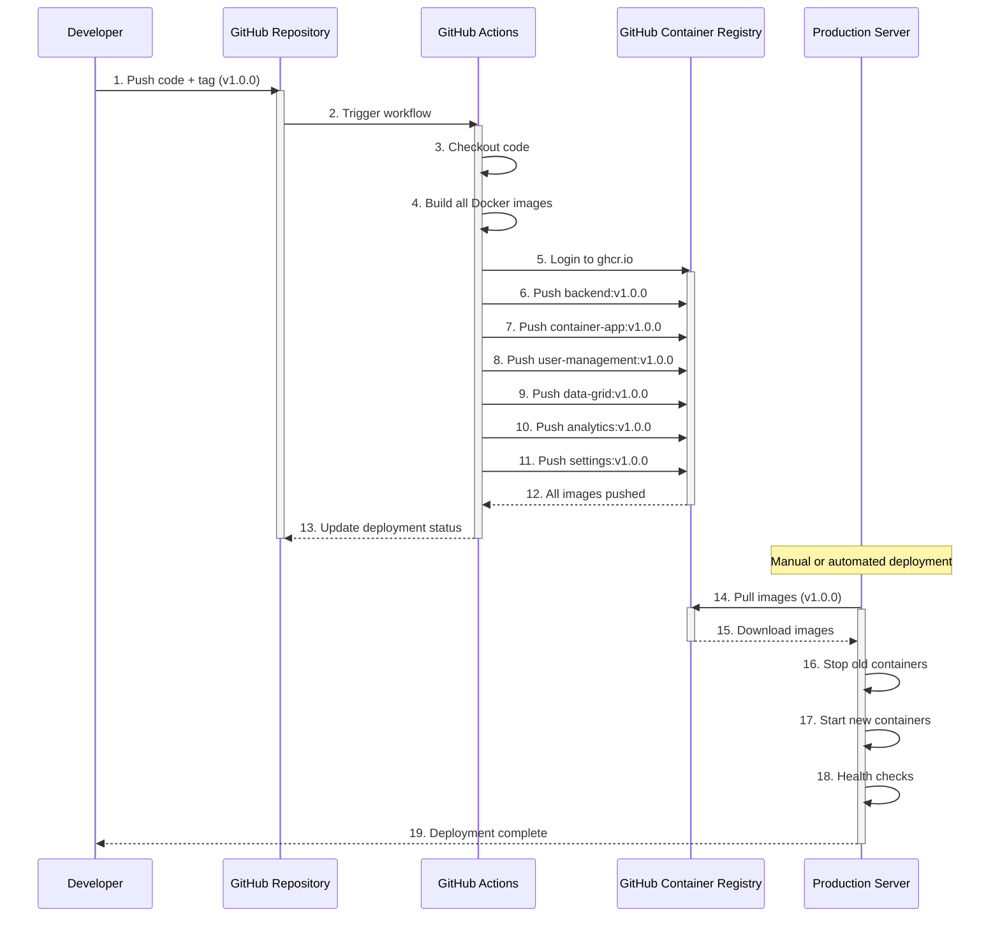

---

## Quick Start

### Prerequisites

- **Docker** >= 20.10
- **Docker Compose** >= 2.0
- **Node.js** >= 18 (for local development)
- **Python** >= 3.11 (for local development)
- **Make** (optional, for convenience commands)

### 🚀 Start All Services (Docker)

```bash
# Clone the repository
git clone https://github.com/your-username/golden-sample-react-micro-web.git
cd golden-sample-react-micro-web

# Generate JWT secrets (first time only)
chmod +x scripts/setup-auth.sh
./scripts/setup-auth.sh

# Start all services
make up

# Or without Make
docker-compose up -d

# View logs
make logs

# Or
docker-compose logs -f
```

### 📊 Access the Applications

| Service | URL | Description |
|---------|-----|-------------|
| **Container App** | http://localhost:3000 | Main host application |
| **User Management** | http://localhost:3001 | User management micro-frontend |
| **Data Grid** | http://localhost:3002 | Data grid micro-frontend |
| **Analytics** | http://localhost:3003 | Analytics micro-frontend |
| **Settings** | http://localhost:3004 | Settings micro-frontend |
| **Backend API** | http://localhost:8000 | FastAPI backend |
| **API Docs** | http://localhost:8000/api/docs | Interactive API documentation |

### 🔐 Demo Credentials

```
Admin User:
  Email: admin@example.com
  Password: admin123

Regular User:
  Email: user@example.com
  Password: user123

Viewer:
  Email: viewer@example.com
  Password: viewer123
```

### 🛑 Stop Services

```bash
make down
# Or
docker-compose down

# Stop and remove volumes
make clean
# Or
docker-compose down -v
```

---

## Technology Stack

### Frontend

| Technology | Version | Purpose |
|------------|---------|---------|
| **React** | 18.2.0 | UI framework |
| **TypeScript** | 5.0+ | Type safety |
| **Webpack** | 5.x | Module bundler |
| **Module Federation** | Webpack 5 | Micro-frontend architecture |
| **Material-UI** | 5.15+ | UI component library |
| **MUI X Data Grid** | 6.18+ | Advanced data grid |
| **MUI X Charts** | 6.18+ | Data visualization |
| **React Router** | 6.21+ | Client-side routing |
| **Axios** | 1.6+ | HTTP client |
| **Emotion** | 11.11+ | CSS-in-JS styling |

### Backend

| Technology | Version | Purpose |
|------------|---------|---------|
| **Python** | 3.11 | Runtime |
| **FastAPI** | 0.104+ | Web framework |
| **Uvicorn** | Latest | ASGI server |
| **Pydantic** | 2.x | Data validation |
| **python-jose** | 3.3+ | JWT handling |
| **passlib** | 1.7+ | Password hashing |
| **bcrypt** | 4.0+ | Secure hashing |

### DevOps

| Technology | Purpose |
|------------|---------|
| **Docker** | Containerization |
| **Docker Compose** | Multi-container orchestration |
| **nginx** | Production web server |
| **GitHub Actions** | CI/CD pipeline |
| **GitHub Container Registry** | Docker image registry |

---

## Project Structure

```
golden-sample-react-micro-web/
├── frontend/
│   ├── container/                    # Container app (host) - Port 3000
│   │   ├── src/
│   │   │   ├── App.tsx              # Main app with navigation
│   │   │   ├── index.tsx            # Entry point
│   │   │   └── pages/               # Page components
│   │   ├── webpack.config.js        # Module Federation config
│   │   ├── Dockerfile               # Production build
│   │   ├── Dockerfile.dev           # Development build
│   │   └── package.json
│   │
│   ├── user-management-app/         # User Management - Port 3001
│   │   ├── src/
│   │   │   └── App.tsx              # Exposed as ./UserManagement
│   │   ├── webpack.config.js
│   │   └── package.json
│   │
│   ├── data-grid-app/               # Data Grid - Port 3002
│   │   ├── src/
│   │   │   └── App.tsx              # Exposed as ./DataGrid
│   │   ├── webpack.config.js
│   │   └── package.json
│   │
│   ├── analytics-app/               # Analytics - Port 3003
│   │   ├── src/
│   │   │   └── App.tsx              # Exposed as ./Analytics
│   │   ├── webpack.config.js
│   │   └── package.json
│   │
│   ├── settings-app/                # Settings - Port 3004
│   │   ├── src/
│   │   │   └── App.tsx              # Exposed as ./Settings
│   │   ├── webpack.config.js
│   │   └── package.json
│   │
│   └── shared-ui-lib/               # Shared library
│       ├── src/
│       │   ├── auth/                # Authentication
│       │   │   ├── AuthContext.tsx  # React Context
│       │   │   ├── AuthService.ts   # Singleton service
│       │   │   └── types.ts         # TypeScript types
│       │   ├── api/
│       │   │   └── apiClient.ts     # Axios instance
│       │   ├── components/          # Shared components
│       │   │   ├── LoginForm.tsx
│       │   │   ├── LoginPage.tsx
│       │   │   └── UserMenu.tsx
│       │   ├── errors/              # Error handling
│       │   ├── theme/               # MUI theme
│       │   └── index.ts             # Exports
│       └── package.json
│
├── backend/
│   └── mock-data-service/           # Backend API - Port 8000
│       ├── auth/                    # Authentication
│       │   ├── jwt_handler.py       # JWT creation/validation
│       │   ├── security.py          # Password hashing
│       │   ├── dependencies.py      # FastAPI dependencies
│       │   └── user_store.py        # In-memory user store
│       ├── routers/                 # API routes
│       │   ├── auth.py              # Auth endpoints
│       │   ├── users.py             # User management
│       │   ├── data.py              # Data operations
│       │   ├── analytics.py         # Analytics
│       │   └── settings.py          # Settings
│       ├── models/                  # Pydantic models
│       ├── config/                  # Configuration
│       ├── main.py                  # FastAPI app
│       ├── requirements.txt         # Python dependencies
│       └── Dockerfile
│
├── docker-compose.yml               # Development orchestration
├── docker-compose.prod.yml          # Production orchestration
├── Makefile                         # Convenience commands
├── .env.example                     # Environment variables template
├── scripts/
│   ├── setup-auth.sh                # Generate JWT secrets
│   └── generate-secrets.sh          # Secret generation
└── secrets/
    ├── jwt_secret_key.txt           # JWT access token secret
    └── jwt_refresh_secret_key.txt   # JWT refresh token secret
```

---

## Key Architectural Decisions

### 1. **Why Module Federation?**

Module Federation enables true micro-frontend architecture where:
- Each micro-frontend can be developed and deployed independently
- Shared dependencies (React, MUI) are loaded only once
- No iframe sandboxing or complex integration patterns needed
- Runtime composition without build-time coupling

### 2. **Why Shared UI Library?**

Centralizing common code in `shared-ui-lib` provides:
- Consistent MUI theme across all applications
- Single source of truth for authentication
- Reusable components and utilities
- Simplified maintenance and updates

### 3. **Why JWT with Refresh Tokens?**

JWT authentication with refresh tokens offers:
- Stateless authentication (no server-side sessions)
- Short-lived access tokens (15 minutes) for security
- Long-lived refresh tokens (7 days) for UX
- Automatic token refresh before expiry
- Cross-tab synchronization via BroadcastChannel

### 4. **Why Docker Compose?**

Docker Compose provides:
- Consistent development and production environments
- Easy service orchestration
- Network isolation and service discovery
- Volume management for hot reload
- Simple secrets management

### 5. **Why FastAPI?**

FastAPI offers:
- High performance with async support
- Automatic API documentation (OpenAPI)
- Type hints and validation with Pydantic
- Modern Python framework
- Easy to extend and maintain

---

## Development Workflow

### Local Development (without Docker)

#### Backend

```bash
cd backend/mock-data-service

# Create virtual environment
python -m venv venv
source venv/bin/activate  # On Windows: venv\Scripts\activate

# Install dependencies
pip install -r requirements.txt

# Run server
uvicorn main:app --reload --port 8000
```

#### Frontend

```bash
# Terminal 1 - Container App
cd frontend/container
npm install
npm start  # Starts on port 3000

# Terminal 2 - User Management
cd frontend/user-management-app
npm install
npm start  # Starts on port 3001

# Terminal 3 - Data Grid
cd frontend/data-grid-app
npm install
npm start  # Starts on port 3002

# Terminal 4 - Analytics
cd frontend/analytics-app
npm install
npm start  # Starts on port 3003

# Terminal 5 - Settings
cd frontend/settings-app
npm install
npm start  # Starts on port 3004
```

### Docker Development

```bash
# Start all services with hot reload
make up

# View logs for specific service
docker-compose logs -f container-app
docker-compose logs -f backend

# Restart a service
docker-compose restart user-management-app

# Shell into a container
make shell-container
make shell-backend

# Check service health
make health
```

### Production Build

```bash
# Build production images
make prod-build

# Start production stack
make prod-up

# Access at http://localhost
```

---

## Troubleshooting

### Common Issues

#### 1. **Module Federation Loading Errors**

**Problem**: Remote micro-frontend fails to load

**Solution**:
- Ensure all micro-frontend services are running
- Check that `remoteEntry.js` is accessible (e.g., http://localhost:3001/remoteEntry.js)
- Verify CORS headers are set correctly
- Check browser console for detailed error messages

#### 2. **CORS Errors**

**Problem**: API calls blocked by CORS policy

**Solution**:
```python
# backend/mock-data-service/main.py
app.add_middleware(
    CORSMiddleware,
    allow_origins=["http://localhost:3000", "http://localhost:3001", ...],
    allow_credentials=True,
    allow_methods=["*"],
    allow_headers=["*"],
)
```

#### 3. **Port Conflicts**

**Problem**: Port already in use

**Solution**:
```bash
# Find process using port
lsof -i :3000  # macOS/Linux
netstat -ano | findstr :3000  # Windows

# Kill process or change port in docker-compose.yml
```

#### 4. **JWT Token Errors**

**Problem**: 401 Unauthorized errors

**Solution**:
- Check that JWT secrets exist in `./secrets/`
- Run `./scripts/setup-auth.sh` to generate secrets
- Verify token expiry settings in backend config
- Clear localStorage and re-login

#### 5. **Docker Build Failures**

**Problem**: Docker build fails

**Solution**:
```bash
# Clear Docker cache
docker system prune -a

# Rebuild without cache
make rebuild

# Check Docker logs
docker-compose logs backend
```

---

## Performance Optimization

### Frontend Optimization

1. **Code Splitting**: Each micro-frontend is lazy-loaded
2. **Shared Dependencies**: React, MUI loaded once via Module Federation
3. **Tree Shaking**: Webpack eliminates unused code
4. **Production Builds**: Minification and optimization enabled
5. **nginx Caching**: Static assets cached in production

### Backend Optimization

1. **Async/Await**: FastAPI uses async for concurrent requests
2. **Connection Pooling**: Efficient database connections (when added)
3. **Response Caching**: Implement caching for expensive operations
4. **Request Validation**: Pydantic validates requests efficiently
5. **Health Checks**: Monitor service health and restart if needed

---

## Security Considerations

### Frontend Security

✅ **JWT Token Storage**: Access tokens in localStorage (short-lived)  
✅ **Refresh Token Security**: HttpOnly cookies (when possible)  
✅ **XSS Prevention**: React escapes content by default  
✅ **HTTPS**: Use HTTPS in production  
✅ **Content Security Policy**: Configure CSP headers  

### Backend Security

✅ **Password Hashing**: bcrypt with salt  
✅ **JWT Signing**: Strong secret keys (256-bit)  
✅ **Token Expiry**: Short-lived access tokens (15 min)  
✅ **CORS Configuration**: Whitelist allowed origins  
✅ **Rate Limiting**: Implement rate limiting (recommended)  
✅ **Input Validation**: Pydantic validates all inputs  

### Docker Security

✅ **Secrets Management**: Docker secrets for sensitive data  
✅ **Non-root Users**: Run containers as non-root  
✅ **Image Scanning**: Scan images for vulnerabilities  
✅ **Network Isolation**: Containers in isolated network  
✅ **Health Checks**: Automatic container health monitoring  

---

## Testing Strategy

### Unit Tests

```bash
# Frontend tests
cd frontend/container
npm test

# Backend tests
cd backend/mock-data-service
pytest
```

### Integration Tests

```bash
# Test Module Federation loading
npm run test:integration

# Test API endpoints
pytest tests/integration/
```

### E2E Tests

```bash
# Cypress or Playwright tests
npm run test:e2e
```

---

## Contributing

We welcome contributions! Please see our contributing guidelines.

### Development Process

1. Fork the repository
2. Create a feature branch (`git checkout -b feature/amazing-feature`)
3. Commit your changes (`git commit -m 'Add amazing feature'`)
4. Push to the branch (`git push origin feature/amazing-feature`)
5. Open a Pull Request

### Code Standards

- Follow TypeScript and Python type hints
- Write tests for new features
- Update documentation as needed
- Follow existing code style
- Ensure all tests pass before submitting PR

---

## License

This project is licensed under the MIT License - see the LICENSE file for details.

---

## Resources

### Documentation

- [Webpack Module Federation](https://webpack.js.org/concepts/module-federation/)
- [React Documentation](https://react.dev/)
- [Material-UI](https://mui.com/)
- [FastAPI](https://fastapi.tiangolo.com/)
- [Docker Documentation](https://docs.docker.com/)

### Related Projects

- [Module Federation Examples](https://github.com/module-federation/module-federation-examples)
- [Micro-Frontend Resources](https://micro-frontends.org/)

---

## Support

For issues, questions, or contributions, please:

- 📧 Open an issue on GitHub
- 💬 Join our discussion forum
- 📖 Check the documentation
- 🐛 Report bugs with detailed reproduction steps

---

## Acknowledgments

Built with ❤️ using modern web technologies and best practices in micro-frontend architecture.

**Key Technologies**: React • TypeScript • Material-UI • Webpack Module Federation • FastAPI • Docker

---

<div align="center">

**⭐ Star this repository if you find it helpful!**

Made with 🚀 by the Micro-Frontend Community

</div>
